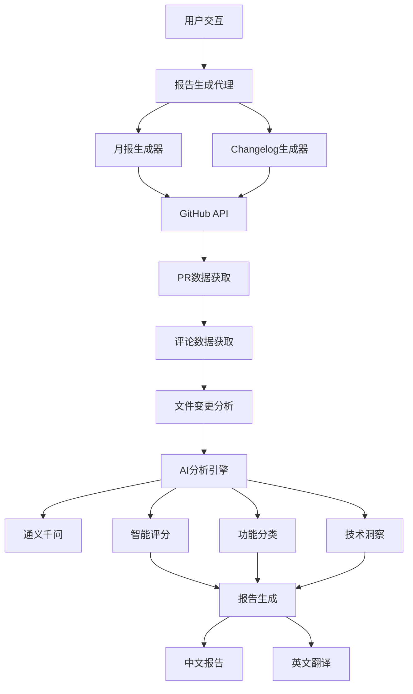
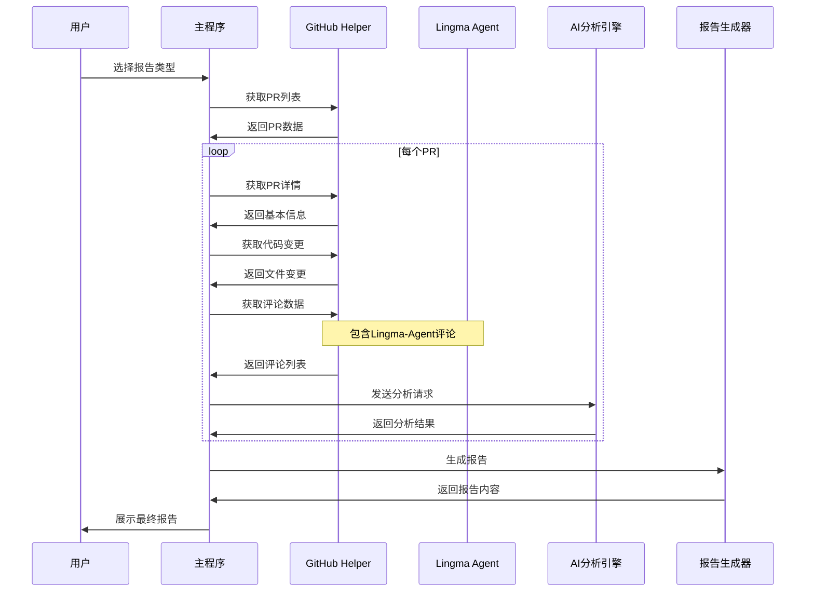

# 🤖 github报告生成代理：让开源项目月报和Changelog自动化的智能助手

## 📖 项目背景

在开源项目的日常维护中，定期生成月报和Changelog是必不可少的工作。传统的方式需要开发者手动筛选PR、分析代码变更、撰写功能描述，这不仅耗时费力，还容易遗漏重要信息。

**github报告生成代理**应运而生，它是一个基于AI的智能报告生成系统，能够自动分析GitHub仓库的PR数据，生成高质量的月报和Changelog。

## 🎯 核心特性

### 🔥 智能PR分析
- **多维度评估**：基于代码复杂度、代码实际更改、用户影响范围的评分体系
- **社区评论联动**：集成Lingma-Agent等机器人评论，提供更全面的PR分析视角
- **重要PR识别**：自动识别关键功能更新，提供详细的技术分析
- **支持对话形式生成月报** 

### 📊 双重报告模式
- **月报模式**：按时间维度自动筛选优质PR，生成社区月报
- **Changelog模式**：基于指定PR列表，按功能类型分组生成版本更新日志

### 🌐 多仓库支持
- **环境变量配置**：支持任意GitHub仓库，无需修改代码
- **灵活切换**：通过简单配置即可适配不同项目需求

## 🏗️ 系统架构

### 整体架构图



### 核心流程图



## 💡 与Lingma-Agent的智能联动

### 评论数据的深度挖掘

项目的一大亮点是能够读取和分析PR中的所有评论，包括**Lingma-Agent**等AI机器人的评论。这种联动带来了以下优势：

1. **代码质量评估**：Lingma-Agent的代码审查意见被纳入分析范围
2. **技术风险识别**：机器人标注的潜在问题成为评分参考
3. **社区互动洞察**：人工评论与机器评论的对比分析
4. **智能化程度提升**：AI与AI的协作，提供更准确的技术判断

## 🚀 快速开始

### 环境配置

1. **克隆并编译 GitHub MCP 服务器**
```bash
git clone https://github.com/github/github-mcp-server.git
cd github-mcp-server
go build -o ../github-mcp-serve ./cmd/github-mcp-server
chmod u+x ../github-mcp-serve
```

2. **安装依赖**
```bash
uv sync
```

3. **配置环境变量**
```bash
# 必需配置
export GITHUB_PERSONAL_ACCESS_TOKEN=your_github_token
export DASHSCOPE_API_KEY=your_dashscope_api_key

# LLM 配置
export MODEL_NAME=qwen-max
export MODEL_SERVER=https://dashscope.aliyuncs.com/compatible-mode/v1

# 可选配置
export GITHUB_REPO_OWNER=alibaba          # 默认：alibaba
export GITHUB_REPO_NAME=higress           # 默认：higress
export GOOD_PR_NUM=10                     # 月报亮点PR数量
export AGENT=true                         # 启用agent模式
```


### 启动服务

```bash
# 运行报告生成器
python report_main.py

# 或者你也可以使用命令行参数运行
python report_main.py --mode=2 --choice=1 --month=7 --year=2025
```

### 交互式使用

```
🤖 github报告生成代理
当前仓库: alibaba/higress
==================================================

请选择要生成的报告类型:
1. 📊 月报 (Monthly Report)
2. 📋 Changelog

请输入选择 (1-2): 1

请输入月份 (1-12, 默认当前月): 12
请输入年份 (默认当前年): 2024
请输入重要PR编号列表 (用逗号分隔，留空则自动识别): 1234,1235
是否生成英文翻译? (y/n, 默认y): y

🔄 开始生成月报...
✅ 获取PR列表完成
🤖 AI分析中...
📊 报告生成完成
🌐 英文翻译完成

报告已保存到: report.md
英文版本已保存到: report.EN.md
```

