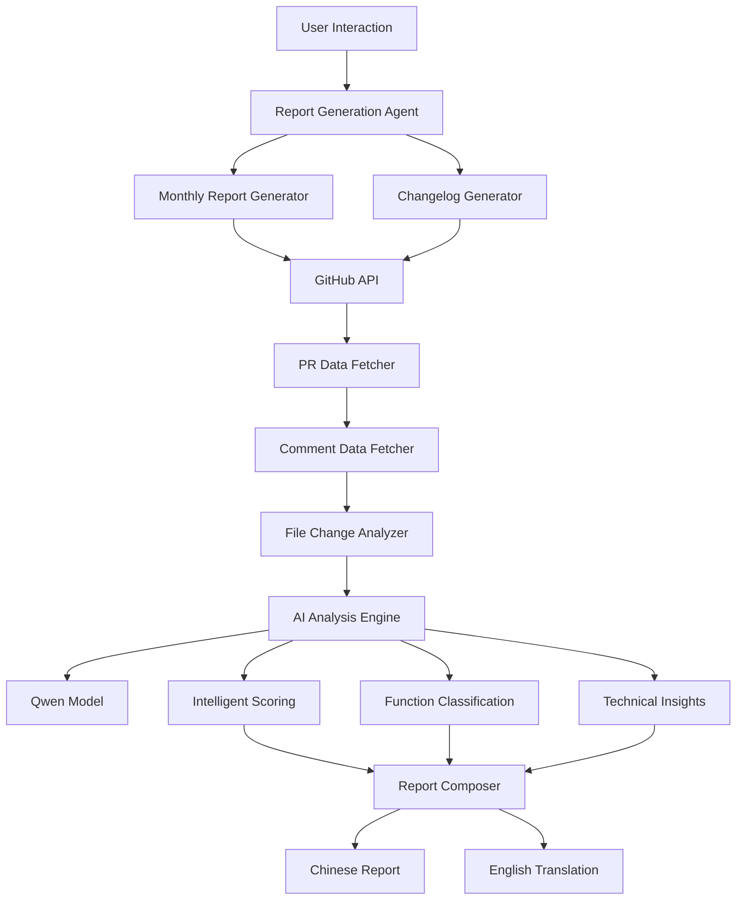
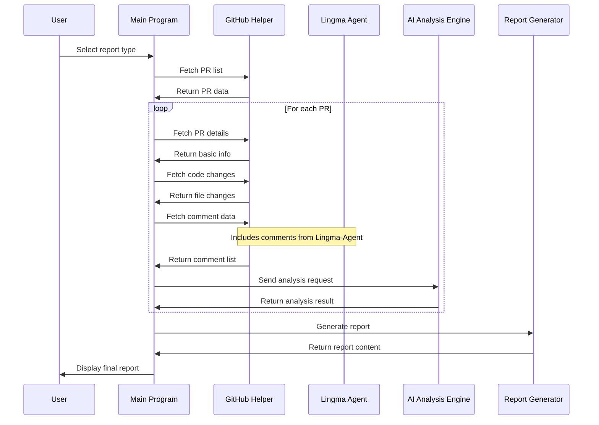

# 🤖 Higress Report Generation Agent: An Intelligent Assistant for Automating Open Source Monthly Reports and Changelogs

## 📖 Project Background

In the daily maintenance of open source projects, regularly generating monthly reports and changelogs is essential. Traditionally, developers need to manually filter PRs, analyze code changes, and write feature descriptions. This process is time-consuming, labor-intensive, and prone to missing important information.

**Higress Report Generation Agent** was created to address this. It is an AI-powered intelligent report generation system that automatically analyzes PR data from GitHub repositories and generates high-quality monthly reports and changelogs.

## DEMO
https://github.com/user-attachments/assets/99183dff-c30e-4beb-91cc-6c183627cbcc

## 🎯 Core Features

### 🔥 Intelligent PR Analysis
- **Multi-dimensional Evaluation**: Scoring system based on code complexity, actual code changes, and user impact
- **Community Comment Integration**: Integrates comments from bots like Lingma-Agent, providing a more comprehensive PR analysis perspective
- **Key PR Identification**: Automatically identifies critical feature updates and provides detailed technical analysis

### 📊 Dual Report Modes
- **Monthly Report Mode**: Automatically filters high-quality PRs by time to generate community monthly reports
- **Changelog Mode**: Generates version changelogs grouped by feature type based on a specified PR list

### 🌐 Multi-Repository Support
- **Environment Variable Configuration**: Supports any GitHub repository without code modification
- **Flexible Switching**: Easily adapt to different project needs through simple configuration

## 🏗️ System Architecture

### Overall Architecture Diagram


### Core Flowchart


## 💡 Intelligent Integration with Lingma-Agent

### In-depth Mining of Comment Data

A highlight of the project is its ability to read and analyze all comments in PRs, including those from AI bots like **Lingma-Agent**. This integration brings the following advantages:

1. **Code Quality Assessment**: Lingma-Agent's code review opinions are included in the analysis
2. **Technical Risk Identification**: Potential issues flagged by bots are considered in scoring
3. **Community Interaction Insights**: Comparative analysis of human and machine comments
4. **Enhanced Intelligence**: AI-to-AI collaboration for more accurate technical judgments


## 🚀 Getting Started

### Environment Setup

1. **Clone and Build the GitHub MCP Server**
```bash
git clone https://github.com/github/github-mcp-server.git

cd github-mcp-server

# build github-mcp-server
go build -o ../github-mcp-serve ./cmd/github-mcp-server 

chmod u+x ../github-mcp-serve
```

2. **Install Dependencies**
```bash
uv sync
```

3. **Configure Environment Variables**
```bash
# Required configuration
export GITHUB_PERSONAL_ACCESS_TOKEN=your_github_token
export DASHSCOPE_API_KEY=your_dashscope_api_key

# LLM configuration
export MODEL_NAME=qwen-max
export MODEL_SERVER=https://dashscope.aliyuncs.com/compatible-mode/v1

# Optional configuration
export GITHUB_REPO_OWNER=alibaba          # Default: alibaba
export GITHUB_REPO_NAME=higress           # Default: higress
export GOOD_PR_NUM=10                     # Number of highlight PRs in monthly report
```

### Start the Service

```bash
# Run the report generator
python report_main.py

# or you can run with cmd args
python report_main.py --mode=2 --choice=1 --month=7 --year=2025
```

### Interactive Usage

```
🤖 Higress Report Generation Agent
Current repository: alibaba/higress
==================================================

Please select the type of report to generate:
1. 📊 Monthly Report
2. 📋 Changelog

Enter your choice (1-2): 1

Enter month (1-12, default is current month): 12
Enter year (default is current year): 2024
Enter list of important PR numbers (comma-separated integers, e.g. `1234,5678`, leave blank for auto-detection): 1234,1235
Generate English translation? (y/n, default y): y

🔄 Generating monthly report...
✅ PR list fetched
🤖 AI analysis in progress...
📊 Report generated
🌐 English translation completed

Report saved to: report.md
English version saved to: report.EN.md
``` 