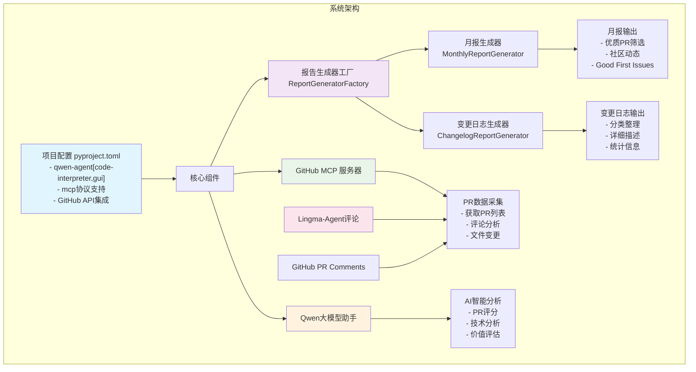

# 🤖 AI驱动的开源项目报告生成：github报告生成代理深度解析

## 📖 项目背景与意义

在开源项目的日常维护中，定期撰写月报和Changelog是一项繁重但必要的工作。开发者往往需要花费大量时间手动筛选PR、分析代码变更、撰写功能描述，这不仅效率低下，还容易遗漏重要信息。

**github报告生成代理**正是为解决这一痛点而生。这是一个基于AI的智能报告生成系统，能够自动分析GitHub仓库的PR数据，生成高质量的月报和Changelog。该项目充分利用了MCP（Model Context Protocol）协议和Qwen大模型的强大能力，实现了从数据获取到报告生成的全流程自动化。

## 🏗️ 项目架构与配置

### 项目技术栈配置

项目基于Python构建，通过`pyproject.toml`管理依赖：

```toml
[project]
name = "higress-report-agent"
version = "0.1.0"
requires-python = ">=3.10"
dependencies = [
    "dotenv>=0.9.9",              # 环境变量管理
    "mcp>=1.8.0",                 # MCP协议支持
    "python-dateutil>=2.9.0",     # 日期处理
    "qwen-agent[code-interpreter,gui]>=0.0.22",  # Qwen AI Agent
]
```

这个配置体现了项目的几个核心特点：
1. **现代化依赖管理**：使用uv作为包管理器，支持工作空间模式
2. **MCP协议集成**：直接与GitHub API对接，无缝获取仓库数据
3. **AI代理能力**：集成Qwen Agent的代码解释和GUI能力
4. **环境灵活性**：支持多仓库配置，易于部署

### 系统架构设计

项目采用了分层架构和设计模式的最佳实践：

- **工厂模式**：`ReportGeneratorFactory`根据需求创建不同类型的报告生成器
- **策略模式**：月报和Changelog采用不同的生成策略
- **模板方法模式**：定义了统一的报告生成流程
- **MCP协议**：实现与GitHub的标准化通信



## 使用qwen-agent框架搭建

`qwen-agent` 是项目中的 AI 基础设施，负责统一管理大模型调用、工具注册以及任务执行流程。得益于该框架，我们无需从零实现提示工程和工具路由逻辑，就能快速获得一个具备"代码解释 + GUI + 工具调用"能力的 AI Agent。其在本项目中的作用主要体现在：

1. **统一的工具调度**
   - 将 `github-mcp-serve` 暴露出的 `repos`、`pull_requests`、`issues` 等能力注册为 Agent 工具。
   - 内置 `code-interpreter` 工具，可在生成报告时动态执行 Python 代码，对 PR 数据做进一步统计分析。
2. **上下文记忆与多轮对话**
   - 基于 `Qwen` 大模型的长上下文特性，对话过程中可以持续引用之前拉取的 PR、Issue 数据，保证分析链路的连贯性。
3. **可视化交互界面**
   - 借助 `qwen-agent[gui]`，开发者只需执行 `uvicorn webgui:app` 即可获得一个本地 Web UI，方便非开发人员使用。
4. **插件式扩展**
   - 通过简单的 YAML/JSON 声明即可为 Agent 增加新的工具，如 Jira、Slack 通知等，满足企业级流程整合需求。
5. **简洁的配置方式**
   - 只需在环境变量中声明 `MODEL_NAME`、`MODEL_SERVER` 即可切换模型或服务商；其余推理参数支持在 `qwen-agent` 配置文件中按需微调。

示例配置片段：

```python
from qwen_agent import Agent

agent = Agent(
    model_name=os.getenv("MODEL_NAME", "qwen-max"),
    model_server=os.getenv("MODEL_SERVER"),
    tools=tools,               # 上文定义的 MCP + 内置工具
    temperature=0.3,           # 保持输出的确定性
)
```

得益于 `qwen-agent` 提供的高层抽象，本项目的核心逻辑可以聚焦在"如何定义 PR 价值评估和报告模板"上，将底层的 LLM 调用与工具管理完全解耦，大幅提升了开发效率和可维护性。

## 🚀 核心功能解析

### 1. 智能PR分析系统

项目最大的亮点是其智能的PR分析能力。系统采用多维度评估体系：

- **技术复杂度评分（50分）**：基于代码变更量、架构影响、实现难度
- **用户影响范围（40分）**：评估对用户体验和功能的影响程度  
- **代码质量指标（30分）**：考虑代码行数、复杂度、规范性
- **Bug重要性（9分）**：针对修复类PR的专项评分

系统能够自动识别文档类、功能类、修复类、测试类PR，并给出相应的评分策略。

### 2. 双重报告模式

**月报模式**：
- 时间维度筛选：自动获取指定月份的所有合并PR
- 智能评分排序：基于评分系统选出优质PR
- 社区动态整合：包含Good First Issues和社区统计
- 重要PR深度分析：提供使用背景、功能详述、使用方式、功能价值四个维度的详细分析

**Changelog模式**：
- 按功能分类：自动将PR分为feature、bugfix、doc、refactor、test五大类
- 格式化输出：符合标准Changelog格式
- 统计信息汇总：提供清晰的版本更新概览

### 3. 多语言支持与自动化

项目内置了强大的翻译能力：
- 基于LLM的智能翻译，保持技术术语准确性
- 维护Markdown格式完整性
- 同时生成中英文版本报告

## 🤝 与Lingma-Agent的智能联动

### 评论数据的深度挖掘

项目的一个重要创新是能够读取和分析PR中的所有评论，特别是**Lingma-Agent**等AI机器人的评论。这种AI与AI的协作带来了以下优势：

1. **代码质量评估增强**：将Lingma-Agent的代码审查意见纳入分析范围，提供更全面的质量判断
2. **技术风险识别**：机器人标注的潜在问题成为PR评分的重要参考依据
3. **社区互动洞察**：通过对比人工评论与机器评论，获得更深层的社区协作见解
4. **智能化程度提升**：多个AI系统的协作显著提高了技术判断的准确性

在代码实现中，评论分析模块会：
```python
def _get_pr_comments(self, owner: str, repo: str, pr_number: int, github_helper) -> List[Dict[str, str]]:
    """获取PR评论信息，包括AI机器人评论"""
    comments_data = github_helper.get_pull_request_comments(
        owner=owner, repo=repo, pullNumber=pr_number
    )
    # 处理所有评论，包括Lingma-Agent等机器人评论
    for comment in comments_data:
        comment_info = {
            "author": comment.get("user", {}).get("login", "unknown"),
            "body": comment.get("body", "")[:300],
            "created_at": comment.get("created_at", "")
        }
```

这种设计使得AI代理能够充分利用社区中已有的AI工具产生的智能评估，形成了一个良性的AI生态协作模式。

## 💻 使用方式与配置

### 环境配置

项目支持灵活的环境配置，通过环境变量控制行为：

```bash
# 必需配置
export GITHUB_PERSONAL_ACCESS_TOKEN=your_token
export DASHSCOPE_API_KEY=your_key

# LLM 配置
export MODEL_NAME=qwen-max
export MODEL_SERVER=https://dashscope.aliyuncs.com/compatible-mode/v1

# 可选配置
export GITHUB_REPO_OWNER=alibaba
export GITHUB_REPO_NAME=higress
export GOOD_PR_NUM=10  # 月报亮点PR数量
```

### 交互式使用

项目提供了友好的交互式界面：

```
🤖 github报告生成代理
当前仓库: alibaba/higress
==================================================

请选择要生成的报告类型:
1. 📊 月报 (Monthly Report)
2. 📋 Changelog

请输入选择 (1-2): 1
```

用户可以方便地选择报告类型、设置时间范围、指定重要PR等。

### 重要PR的特殊处理

项目对重要PR提供了特殊的详细分析功能。当用户指定某些PR为重要PR时，系统会：

1. **深度技术分析**：获取完整的代码变更（patch）信息
2. **四维度详述**：使用背景、功能详述、使用方式、功能价值
3. **社区反馈整合**：结合所有评论进行综合分析
4. **专业文档生成**：产出专业级的技术文档

## 🔧 技术实现亮点

### 1. MCP协议的深度应用

项目充分利用了MCP协议的能力，实现了与GitHub的无缝对接：

```python
tools = [{
    'mcpServers': {
        'github-mcp-serve': {
            'command': './github-mcp-serve',
            "args": ["stdio", "--toolsets", "issues", "--toolsets", "pull_requests", "--toolsets", "repos"],
            "env": {"GITHUB_PERSONAL_ACCESS_TOKEN": os.getenv("GITHUB_PERSONAL_ACCESS_TOKEN")}
        }
    }
}]
```

### 2. 策略模式的优雅实现

通过抽象基类定义通用流程，子类实现具体策略：

```python
class ReportGeneratorInterface(ABC):
    @abstractmethod
    def get_pr_list(self, **kwargs) -> List[PRInfo]:
    
    @abstractmethod
    def analyze_prs_with_llm(self, pr_list: List[PRInfo]) -> List[PRInfo]:
    
    @abstractmethod
    def generate_report(self, analyzed_prs: List[PRInfo]) -> str
```

### 3. 错误处理与容错机制

项目具备完善的异常处理机制，确保在网络问题、API限制等情况下仍能正常工作。

## 📊 实际应用效果

从生成的报告质量来看，该系统已经能够产出专业水准的技术文档。以实际生成的报告为例：

- **自动识别功能类型**：准确区分新功能、Bug修复、重构优化等
- **技术描述专业**：能够准确描述Google Cloud Vertex AI集成等复杂技术特性
- **影响评估准确**：合理评估功能对用户的实际价值
- **格式规范统一**：生成符合标准的Release Notes格式

## 🎯 项目价值与展望

### 当前价值

1. **效率提升**：将月报和Changelog的生成时间从数小时缩短到几分钟
2. **质量保证**：基于AI的分析比人工筛选更加客观和全面
3. **标准化输出**：确保报告格式的一致性和专业性
4. **多语言支持**：自动生成中英文版本，满足国际化需求

### 技术创新点

1. **AI协作模式**：率先实现了多AI系统的协作分析
2. **MCP协议应用**：在开源项目中深度应用MCP协议
3. **评分体系设计**：建立了科学的PR价值评估体系
4. **模式化架构**：采用了多种设计模式，代码结构清晰

### 未来发展方向

随着AI技术的不断发展，该项目还有很大的扩展空间：

1. **更多数据源整合**：接入更多的AI分析工具和社区数据
2. **个性化配置**：支持不同项目的个性化报告模板
3. **实时监控**：提供PR质量的实时监控和预警
4. **社区生态**：构建更大的AI协作生态系统

## 🏆 总结

github报告生成代理项目展示了AI技术在开源项目管理领域的巨大潜力。通过智能化的PR分析、多模式的报告生成、以及与其他AI工具的协作，该项目不仅提高了开发效率，更为开源社区的智能化发展提供了新的思路。

这个项目的意义不仅在于解决了具体的痛点问题，更在于它展示了如何将现代AI技术与传统开发流程相结合，创造出真正有价值的智能化工具。对于任何有志于将AI技术应用到实际开发场景的团队来说，这都是一个值得学习和借鉴的优秀实践。

---

*本文介绍的github报告生成代理项目体现了AI技术在开源项目管理中的创新应用，通过智能化的PR分析和报告生成，为开源社区提供了高效、专业的解决方案。* 